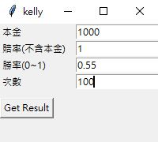
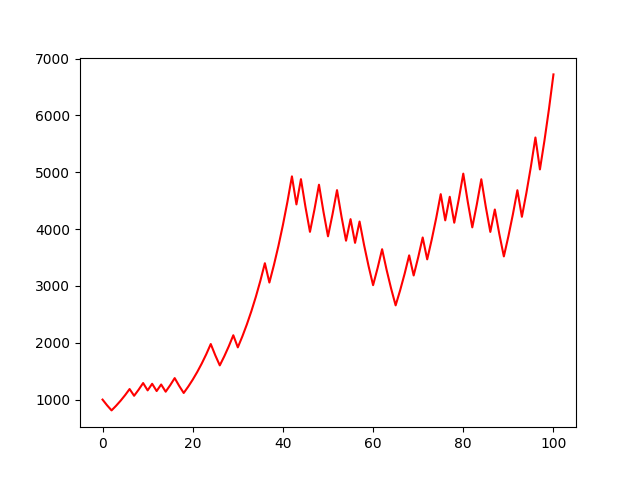
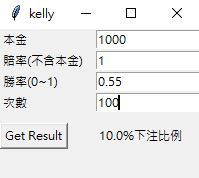

# 凱利策略

# 專案說明

### 專案動機

本專案為實現投資股票及賭博人士必知的凱利公式，透過簡單的Gui介面讓使用者可以根據不同的條件來測試凱利公式的回報率

### 專案架設

使用python來實現演算法的實作，搭配tkinter來架設簡易的使用介面

### 環境安裝

- 安裝依賴庫
    
    ```bash
    pip install matplotlib
    ```
    
- 運行gui.py
    
    ```bash
    python gui.py
    ```
    

### 操作方式

- 輸入本金(輸入有多少單位的部位)
- 輸入賠率(因不含本金，所以只看回報率的部分，假設賭1賠2則為2 - 1 = 1)
- 輸入勝率(0~1所以當假設當勝率50%則為50/100 = 0.5)
- 輸入次數(要下注的次數)
    
    
    
- 輸入完畢按下Get Result即可顯示結果
    
    
    
    x軸為下注次數，y軸為本金金額
    
- 可以查看凱利公式推薦你的下注尺寸
    
    
    
- 關閉圖表後可以再次輸入